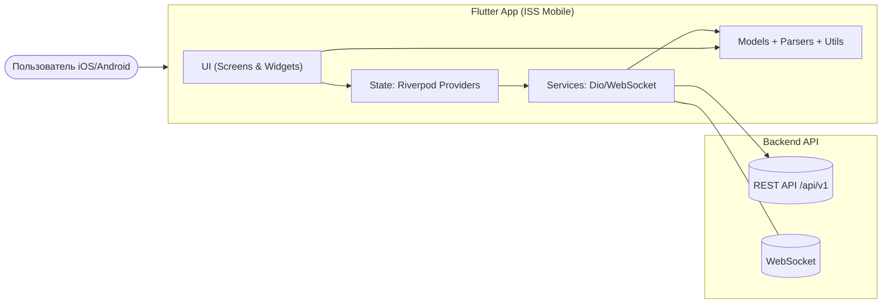
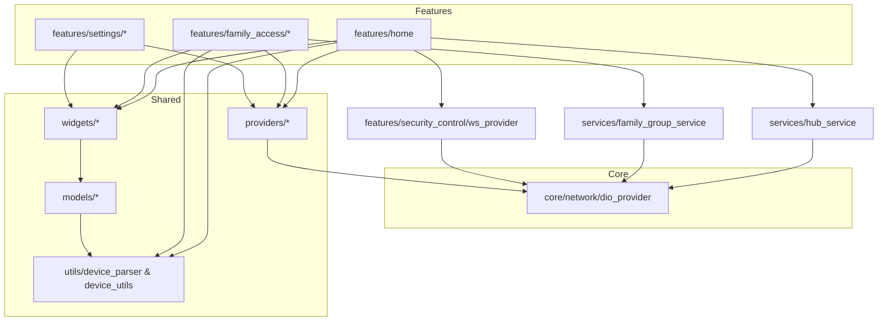

# ISS

A new Flutter project.

## Getting Started

This project is a starting point for a Flutter application.

A few resources to get you started if this is your first Flutter projects:

- [Lab: Write your first Flutter app](https://docs.flutter.dev/get-started/codelab)
- [Cookbook: Useful Flutter samples](https://docs.flutter.dev/cookbook)

For help getting started with Flutter development, view the
[online documentation](https://docs.flutter.dev/), which offers tutorials,
samples, guidance on mobile development, and a full API reference.

---

# ISS Mobile Architecture

## 📱 Описание
Приложение для управления хабами и системой безопасности с поддержкой **семейного доступа**.  
Стек: **Flutter**, **Riverpod**, **Dio**, **WebSockets**, **GoRouter**.  

### Основные фичи
- Управление хабами (ARM/DISARM, мониторинг, привязка/отвязка).
- Семейный доступ: группы, роли (OWNER/ADMIN/USER/GUEST).
- Управление участниками и их правами.
- Работа через REST API и WebSocket.

---

## 📂 Структура проекта

---

## 🏗 Архитектура

### 1. System Context


```mermaid
flowchart TB
  settings[SettingsScreen] -->|tap "Семейный доступ"| groups[FamilyGroupsScreen (список)]
  groups -->|tap item| groupDetails[FamilyGroupScreen (детали)]

  subgraph FamilyGroupsScreen
    groups -->|Pull/Refresh| getMyGroups[GET /family-group/]
    groups -->|Delete group| deleteGroup[DELETE /family-group/{groupId}/delete]
  end

  subgraph FamilyGroupScreen
    groupDetails --> hubs[Хабы группы]
    groupDetails --> members[Участники]
    groupDetails --> actions[Действия с группой]
  end

  hubs -->|Attach| attach[POST /family-group/{groupId}/hub/{hubId}/attach]
  hubs -->|Detach| detach[POST /family-group/{groupId}/hub/{hubId}/dettach]
  hubs -->|ARM| arm[POST /family-group/{groupId}/arm-security/{hubId}]
  hubs -->|DISARM (PIN)| disarm[POST /family-group/{groupId}/disarm-security/{hubId}]

  members -->|Add| addMember[POST /family-group/add-member/{groupId}]
  members -->|Change role| updRole[PUT /family-group/{memberId}/update-member-role]
  members -->|Delete| delMember[DELETE /family-group/{memberId}/delete-member]

  actions -->|Rename| rename[PUT /family-group/{groupId}/update-group-name?name=]
  actions -->|Transfer owner| transfer[POST /family-group/{groupId}/transfer-ownership/{memberId}]
```


